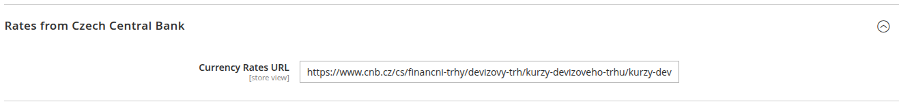
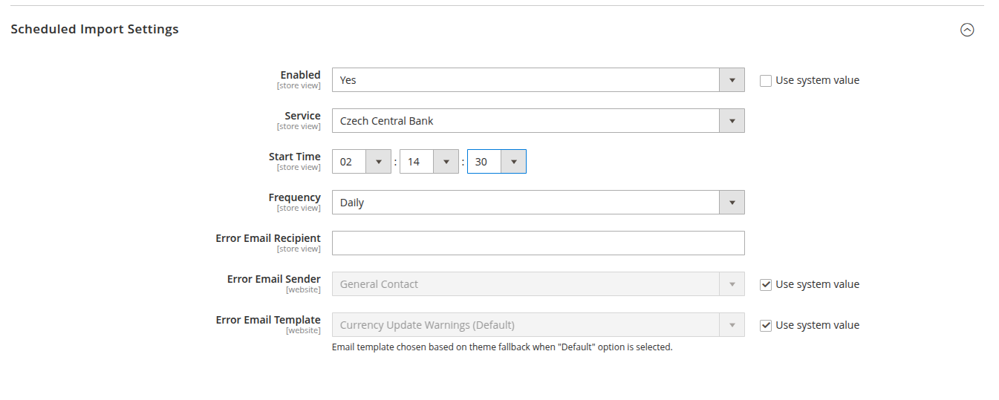

# TEST MODULE - Isols Currency Rates Module

### Install Manually

1. Download the extension.
2. Unzip the file.
3. Create a folder `{Magento root}/app/code/Isols/CurrencyRates`.
4. Copy the content from the unzipped folder.
5. Run the following Magento CLI commands:

```sh
php bin/magento module:enable Isols_CurrencyRates --clear-static-content
php bin/magento setup:upgrade
php bin/magento setup:di:compile
php bin/magento cache:flush
```

## Configuration

After installation, navigate to **Stores → Configuration → Currency Setup → Currency Exchange Rates**.

You will see an option to select `Czech Central Bank` as the currency exchange provider.



## Scheduled Import Settings

To enable currency rate updates:

1. Go to **Stores → Configuration → Currency Setup → Scheduled Import Settings**.
2. Select `Czech Central Bank` as the import service.
3. Set the import schedule according to your needs.


